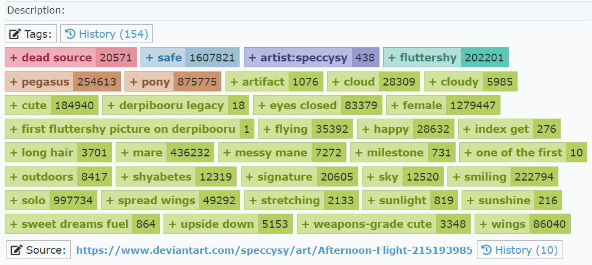
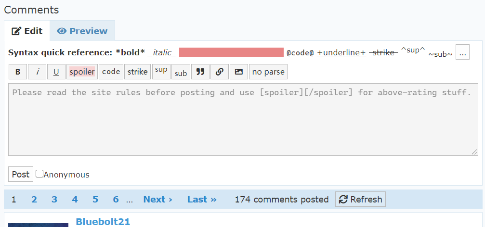
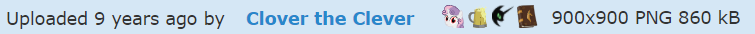
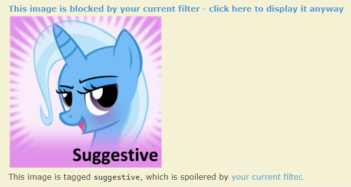
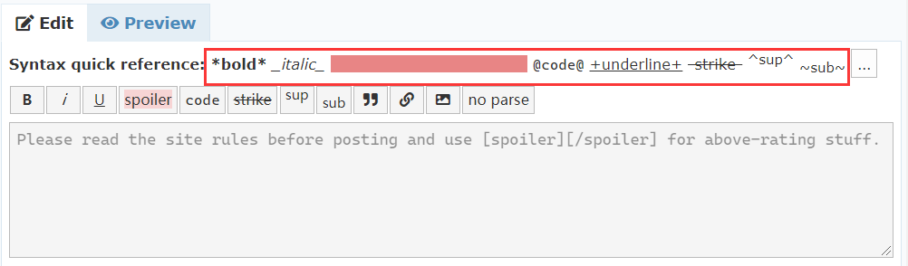
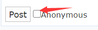

# 1. 图片的相关操作

在 Derpibooru 里，每张图片都有一个唯一的数字 id，这个 id 是根据上传顺序增序的。

如果已知一张图的 id，可以输入 derpibooru.org/id 来访问这张图。例如，1 号图片的地址就是 derpibooru/1。

图片页面由以下部分组成：

* 顶部操作栏


* 图片本体


* 广告区（图中的 furbooru 也是一个基于 philomena 的图站。）


* 详细信息，包括图片描述、标签、图片源地址。




* 评论区




# 1.1 顶部操作栏

这里介绍一下比较常用的功能。

首先是**分数系统**。


图片的分数系统包含四个元素：收藏数，顶数，分数，踩数，评论数。


其中只有顶踩会影响分数。收藏的图片会放在 https://derpibooru.org/search?q=my:faves 中，而且收藏操作也会自动顶图。

图片的分数主要用于图片排序和过滤条件，比如近期热图 Trending Image 就是采用 Wilson score 进行排序。


然后是**查看与下载**。


View 是查看，Download 是下载，View/Download 和 VS/DS 的功能是一样的，区别在于文件名是否包含标签信息。

例如，Download 下载的文件名是

```
1__dead+source_safe_artist-colon-speccysy_fluttershy_pegasus_pony_artifact_cloud_cloudy_cute_derpibooru+legacy_eyes+closed_female_first+fluttershy+picture.png
```

而 DS 下载的文件名是简单的 `1.png`。


最后是**图片的信息**。



它告诉我们图片于何时上传，上传者是谁，图片的尺寸，格式以及大小。


# 1.2 图片查看

对于一般的图片，在进入图片页面后就会显示图片本身。

但是，对于处于 Spoiler/Hide 状态的图片，需要你点击一下，才会显示出来。

最常见的 spoiler 就是 suggestive，因为图片可能包含不适合公开阅览的内容（例如轻微色图）。其它例如 vulgar（粗话），seizure warning（闪烁瞎眼）也比较常见。

在 MLP:FiM 大结局之前，还有一种常见的 spoiler 就是 spoiler（剧透），现在已经几乎没有了。




如果一张图片很大，那么加载起来可能会比较困难。因此页面第一次呈现的图片一般都是缩略图片。当你再次点击这张图的时候，才会加载原图。


点击前。


点击后。


对于特别大的图片，点击第二次还能再次放大。点击第三次，就会回到缩略图状态。

# 1.3 评论

评论的特殊格式在评论区上方已经有提示了，根据自己的需要使用即可。




特别的，如果你要在评论插入一张本站的图片，可以使用 `>>1t` 的格式，这样就会插入图片本身，而且可以点击直达图片的网页。而如果是 `>>1` 插入的就是一个链接。在输入完成后，可以点击 Preview 查看最终效果。


最后，Derpibooru 是允许匿名评论的，所以你可以点击 Anonymous 选项来隐藏自己的身份。

