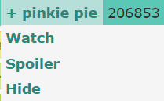

# 2. 标签系统

就像在视频网站发布视频的时候需要你填写相关话题，每一张图片在上传到 Derpibooru 的时候都需要打上相关标签，而且越详尽越好。

标签的重要性体现在图片筛选和搜索上。

每个人都有自己喜欢的和不喜欢的图片类型，当你遇到喜欢的标签，你可以对其进行 Watch，这样相关的图片都会推送到你的 Watchlist。而如果你不喜欢某类标签，则可以选择 Spolier 或者 Hide 操作。

除此之外，Derpibooru 的搜索系统也是基于标签的。图片没有标题，网站也不提供模糊搜索，你必须精确地提供一个标签才能搜到图片。

不同的标签可能含有同一个含义，这一般是方便搜索，例如 `Twilight Sparkle` 和 `ts` 都指向暮光闪闪。

**标签不区分大小写**，下面为了美观可能会加入一些大写字母。

# 2.1 基础标签简介

在网站 Tag Guidelines 有标签使用的相关说明，这里简单总结一下。

### 2.1.1 分级标签

Derpibooru 允许上传少儿不宜的内容（各种方面的），因此为了方便浏览，每一张图都需要有一个分级标签。普通的图片可以自由出现，而涉及性描写或者令人恶心的内容就需要根据用户设置来决定是否出现。

每一张图都需要打上**性描写标签**。

* `safe`，上班能看的图片，小孩能看的图片，正剧出现的图片。非常安全。
* `suggestive`，包含性暗示的图片。这里的程度可高可低，详细标准就不列出来了。
* `questionable`，有胸部点露出、女性骆驼趾的图片，或者基本上离 R18 就差一步的图。
* `explicit`，R18 的图片。

除此之外还有**暗黑分级**和**恶心分级**。请注意，**有这些分级的就不能打 safe**。

* `semi-grimdark`，一般般的暗黑，比如萍卡美娜拿着一把刀，角落里的云宝眼睛已经变成了 X。
* `grimdark`，会让人做噩梦的暗黑，比如萍卡美娜拿着带血的刀，自己和云宝身上溅满了血。
* `grotesque`，令人反胃，比如含有断肢或者奥利给的图片。

### 2.1.2 角色标签

角色标签都是按角色全名。大多数角色都有标签缩写。部分角色拥有别名，别名是和原名并行的，指向不同的内容。

* `Twilight Sparkle`，缩写 `ts`
* `Rarity`，缩写 `ry`
* `Sunset Shimmer`，缩写 `sus`
* `DJ pon-3`，缩写 `dj`，别名 `Vinyl Scratch`

如果你想知道一个角色的缩写，就在搜索框里输入全名。例如，我想知道糖糖的缩写是什么，就在搜索框里填写 `bon bon`。然后搜索结果中就会有以下提示信息：

**Aliases** 告诉我们这个标签有什么等价写法，于是我们就知道搜索 `bon` 也能找到 `bon bon` 这个标签。

**Implies** 告诉我们相关的标签，例如 `cake` implies `food`，而与 Bon Bon 相关的就是她的“真实名称”。然而，`bon bon` 和 `sweetie drops` 并不等价，虽然一般的图片都会同时带上这两个标签。

特别地，对于自创角色（OC），都统一带上 `oc` 标签，且如果 oc 有名字的话，也在名字前加 oc 前缀，例如 `oc:sugar morning`。

### 2.1.3 剧集标签

对于正剧，有两种标签方式。例如，对于 S05E03：

* `spoiler:s05e03`，不管是正剧，EQG 还是 Pony Life，使用编号的时候都在前面加 spoiler 前缀。

* `castle sweet castle`，即本集的名称。

对于 Equestria Girls 短剧和 Pony Life，基本上都可以靠名称来搜索到。

### 2.1.4 其它常见的标签

* artist:???，例如 artist:tohupo，艺术家标签，每一张图都需要标注作者。
* edit，图片是在某张图的基础上编辑得来的。
* spoiler，可能会造成剧透。
* vulgar，包含脏话。
* seizure warning，包含闪烁，以免浏览者犯光敏性癫痫。
* solo，图片只有一个角色。
* 3d，立体的图像。
* simple background，单调的背景。

# 2.2 标签的相关操作

将鼠标悬停在标签上，就能看到相关的操作。

### 2.2.1 关注（Watch）与关注列表（Watchlist）

对你喜欢的标签，你随时可以点击 Watch 进行关注，或者在关注后点击 Unwatch 取关。

关注标签后，在首页上会出现一个 Watched Images 栏目。这个栏目呈现的内容实际上是特殊搜索 `my:watched`，凡是带有已关注标签的图片都会在这里出现。

关注机制不与遮盖和隐藏机制冲突，实际上它相当于把你关注的标签通过与逻辑进行了一个搜索。

当你关注了某个标签，标签前的 + 号会变成 - 号。

### 2.2.2 遮盖（Spoiler）与隐藏（Hide）

Spoiler 和 Hide 操作涉及过滤器，这些内容将在后续的章节细说。

在这里简单介绍一下，如果你 Spoiler 了一个标签，那么相关的图片就会在展示之前遮盖住，只有点击进去了，才能观看到这个图片。

而如果你 Hide 了一个标签，那么相关的图片将完全不会出现，搜索的话也只能得到空白结果。只有输入图片的链接，才能访问到这个图片。

遮盖和隐藏只在使用自定义滤器时出现。如果你使用全局滤器，那么这些操作会消失，取而代之的是一个前往滤器设置页面的选项。

