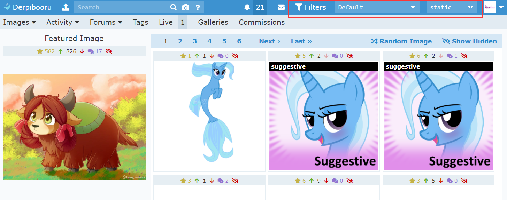
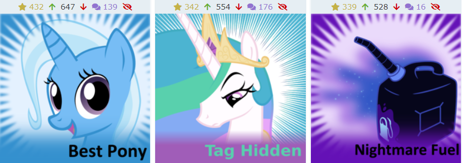
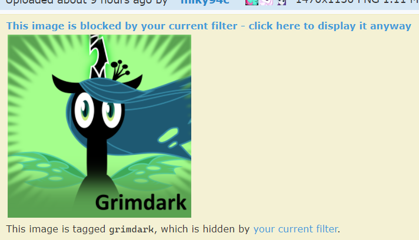
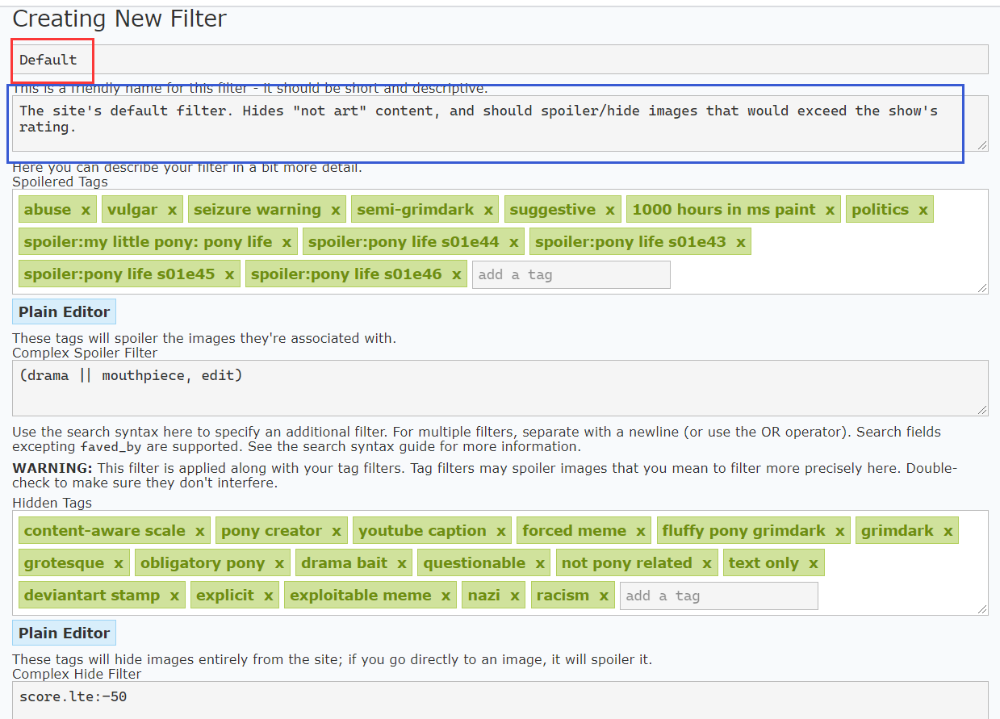
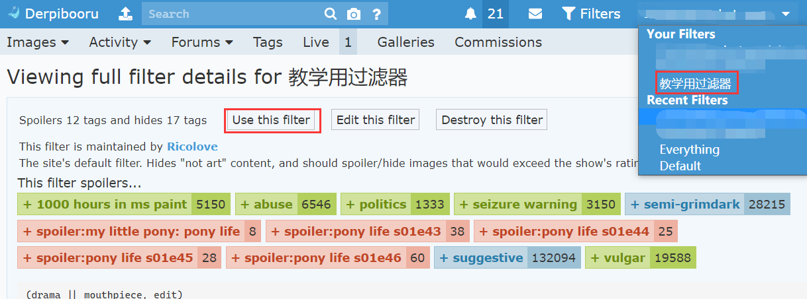
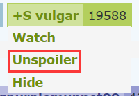
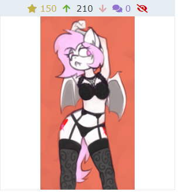

# 3. 过滤器系统

过滤器提供了遮盖（Spoiler）和隐藏（Hide）的功能。这两种功能是基于标签的，如果某张图的标签被设置了 Spoiler 或者 Hide，那么就会有相应的可见性限制。

在网站右上角，头像旁边，可以看到过滤器的相关设置。

* Filters 选项可以前往过滤器设置页面。

* 写着 Default 的下拉菜单可以改变当前使用的滤器。
* 写着 Static 的下拉菜单可以改变 Spoiler 图片的展示方式。

## 3.1 遮盖和隐藏

通过遮盖和隐藏的配置，你可以借助滤器来让网站**不显示**一些图片。当你在公共场合看马图的时候，把 R18 的图片隐藏起来是很有必要的功能。

正如前面说到，这两种状态都是基于标签的。

----

**对于被遮盖的图片**，虽然会从图片列表中显示出来，但是在呈现原图之前，会先显示一个遮盖图。

上面左边是 safe 的图，因此会直接显示。而右边是 suggestive 的图，因此会显示一个有 Trixie 的遮盖图。

点击到图片页面，依然会显示遮盖图。只有在你点击了遮盖图之后，原图才会显示出来。

在 `official spoiler image` 这个标签下可以看到网站当前使用的遮盖图。

当你设置某个标签为 Spoiler 状态后，如果这个标签有专属的遮盖图，那么就显示这张图。否则，默认使用 tag hidden 这张图。

特例是，如果你直接搜索某个 Spoiler 状态下的标签，那么遮盖就会被取消。

----

**对于被隐藏的图片**，这张图会从图片列表中消失，如果你搜索 Hide 状态的标签，那么一张图都不会呈现出来。

但是，如果你借助链接直接打开了某张被隐藏的图片，那么图片还是可以看到的，这时候会像遮盖的图那样用一张遮盖图挡住。

## 3.2 如何构建你的滤器

Derpibooru 提供了一些基础滤器，其中最常用的就是 Default 和 Everything。

* Default，就是默认的滤器，提供最安全的图片内容。
* Everything，什么都不遮挡，全部图片都会呈现。

但是，并不是说 Everything 就会让你拥抱美好的色图世界。因为之前也说过，少儿不宜的东西不只是色情内容。什么吃粑粑啊，被粑粑吃啊（？），各类精神污染也会一并呈现出来。所以最好的选择是构筑一个自己的滤器。

推荐的方法是点击 Default 的 Copy and Customize。然后就会进入新建滤器页面。

红色方块的是滤器名称，比如你可以像我一样取一个 `Ricolove's Default`，或者简单的 `My default` 之类的。蓝色方框的是滤器描述，可以根据自己的需要随便改改。

点击 Save Filter 按钮，滤器就创建成功了。这时你可以点击红框中的 Use this filter 启用你的新过滤器，但是最常用的方法是使用下拉菜单，点击切换。

刚刚的页面是一些比较技术性的滤器设置，如果你懒得研究的话，就不要动了，然后通过可交互的标签来操作 Spoiler 和 Hide。例如，我不怕脏话，我想取消 `vulgar` 的遮盖。那么，你可以把鼠标放在这个标签上，这时候就会有 Watch, Spoiler 和 Hide 的选项。

点击 Unspoiler，从此 `vulgar` 就不会被遮盖了。

Hide 也是同理的，这里就不赘述了。

## 3.3 遮盖的展示方式

在滤器旁边可以调整遮盖在缩略图状态时的展示方式。

* static：点击图片，进入图片页面后，再点击遮盖图，才能看到原图。
* click：点击缩略图，会展示原图，再次点击才进入图片页面。
* hover：鼠标悬停在缩略图上，就会显示原图。
* off：关闭遮盖图功能。

这是被遮盖的状态。

这是展示出来的状态。