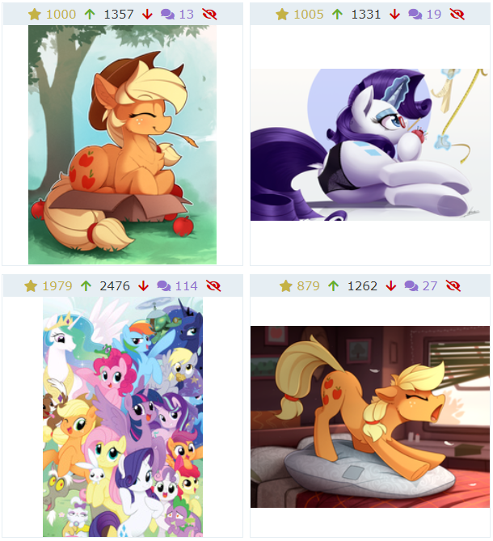

# 4. 搜索系统

网站顶部栏左侧就是搜索框。同时，每一个搜索结果的下方也会提供一个搜索框，并且这个搜索框有更多的点选项。

## 4.1 搜索的语法

不同于一般的论坛/搜索引擎，作为一个图站，Derpibooru 的搜索系统是**基于标签的搜索**。

它既不支持描述文字的搜索，也不支持标题搜素（虽然本来就不存在标题）。

也就是说，如果你搜索 `yellow pony with pink hair`，这对一般的搜索引擎来说可以理解，但是在 Derpibooru 不会有任何返回结果。

下面我们由浅入深地探讨如何使用 Derpibooru 的搜索功能。请注意，本文不会把所有的搜索参数介绍全，有兴趣的话你应该查阅站点自己的说明书，也就是搜索框旁边的问号标。

### 4.1.1 单个标签

单个标签是最基础的搜索。在搜索单个便签的时候，还会显示出该标签的详细信息，比如简短的介绍，别名，关联标签。

在标签部分，我们已经提到了什么是标签的**等价写法**和**相关标签**，以及标签**不区分大小写**的性质。这些性质就是通过搜索系统表现出来的。

需要注意的是，如果你对某些标签设置了遮盖（Spoiler），那么如果你的搜索包含这个标签，就会使相关的遮盖失效。例如，你不喜欢张三的作品，并进行了遮盖。但如果你直接搜索`artist:张三`，那么搜索结果中就不会遮盖张三的图片。

### 4.1.2 多个标签

多个标签用**逗号**分隔。逗号的作用相当于「与」条件。

逗号和标签之间可以存在空格，空格会被省略。也就是说，`a,b,c` 和 `a, b, c`是等价的，并不会导致搜索到含前缀空格的标签。

比如，对于`ts, fs, aj`这样的搜索语句，会得到同时包含 Twilight Sparkle、Fluttershy、Applejack 三个角色的图片。如果其中少了任何一个角色，都不会进入搜索结果。

但是，搜索结果中并不限定只拥有这三个角色。你可能会得到很多包含六位主角的图片。如果你要限定没有 Rarity、Pinkie Pie 和 Rainbow Dash，那么你就需要用下一部分提到的逻辑符号。

### 4.1.3 逻辑符号

逻辑符号有以下三种：

* 与，符号为逗号，`&&` 和 `AND` 
* 或，符号为`||` 和 `OR`
* 非，符号为`-`，`!` 和 `NOT`

以上符号均为半角、大写字母。

在图片中，所有没有包含在搜索语句的标签，都不会产生任何影响。

逻辑符号应该大家都很熟悉，不熟悉的话看看以下例子就了解了。

* `ry, aj` ：同时包含 Rarity 和 Applejack 两个标签的图片，

  

* `ry || aj`，只要有 Rarity 或 Applejack 其中一个就好。两个都有也行。

  

* `ry, aj, !ts, !pp, !fs, !rd`，同时包含 Rarity 和 Applejack， 且不含其它四位主角。

  

需要注意的是，与是优先于或的。例如，`ry, aj || pp` 意味着要么同时有 Rarity 和 Applejack，要么可以只有 Pinkie Pie 一个。如果你是想看 rarijack 或者 raripie 这样的 CP 组合，就应该使用括号：`ry, (aj || pp)`。

### 4.1.4 限定条件

在搜索页面下方的搜索栏里，有一个 Search terms 点选菜单：

这些是搜索的限定条件。

例如，Trending Image 就是限定了`first_seen_at.gt:3 days ago`，即三天之内的图片。

搜索系统提供的条件有很多，我们以 Number of upvotes 为例，也就是顶的票数。点击之后，你的搜索框会多出一个条件，`upvotes.gte:100`。这是一个示例，其中，`.gte`指定大于（**g**reater **t**han）等于（**e**qual），因此这个条件指定的就是顶数大于等于 100 的图片。

而如果你品味独特，想专门看恶评如潮的图片，就可以使用 `score.lt:-10`，就能查看分数小于（**l**ess **t**han）-10 分的图片。什么人才会想看这样的图啊（

除了数量，还可以对时间范围进行限制。例如，我想看 2019 年的图片，那么搜索条件就是`created_at.gt:2018,created_at.lt:2020` 或者 `created_at.eq:2019`。条件后面的年份，实际上可以是一个更具体的时间值，例如 `created_at.gt:2020-06` 可以查看 2020 年 7 月 1 日之后发布的图片。

## 4.2 排序条件

排序是独立于搜索语句的条件，因为它不参与限制哪些图片该出现，而只是决定图片出现的顺序而已。

注意，Descending 是降序，Ascending 是升序

最主要的排序模式是以下几种：

* image ID，即按图片 ID，也就是发布的顺序。
* upvotes/downvotes/score，显然就是分数相关。
* Wilson score，这是一个综合了投票情况的特殊分数。例如，一个200顶100踩的图片，和一个99顶0踩的图片，前者的分数是 100，后者的分数是 99，虽然前者分数高，但是 100 踩说明它也有不讨喜之处，而当后者的顶达到 200 的时候，分数很大可能比前者高，因此综合来看，99顶0踩的图理应放在前面。而 Wilson score 正是解决这一问题的特殊分数。

热门图片的排序方式就是按 Wilson score。在使用纯分数的时代，排在前列的通常都是浓艳的 R18 图，人之本性如此。使用了 Wilson score 之后，这一情况就大为改观了，可爱图重新占了上风。好耶！

## 4.3 搜索实战

现在实战一下。我现在手上有这张照片：

那么怎么在 Derpibooru 上找到这张图的电子版本呢？

首先，我们能看到这张图存在四个角色：Rarity，Applejack，Spike，Opalescence。我们只要在包含这四个角色的图片里筛选就可以了。

然后，使用简写，我们可以确定搜索语句是：`ry, aj, sp, opal`

但是正如我们所料，搜索结果中出现了很多不相关的图片，这些图片中同时出现了许多角色，因此很容易被只有角色的搜索语句捕捉到。

解决的办法有三种：

**第一，使用分数排序。**因为这张图做工精美，必然会有很多人加分。

运气还算好，我们在第二页就发现了这张图。

**第二，添加更多描述标签**。我们观察到 Rarity 的身后有一个木桶，于是我们再加入一个 barrel 标签：

没有任何搜索结果。这也是在预料之中的，因为图片的标签是由 Derpibooru 的所有人来维护的，而不是由某个 AI 自动提取的。很可能是这张图没有被加入 barrel 这个标签，所以无法搜到。

**第三，限定不出现角色**。我们直接禁止其余四个小马主角出现在我们的搜索结果里。

这次的结果非常好，第二个图就是我们想要的结果。

## 4.4 图片搜索

Derpibooru 是支持图片搜索的，但是效果很有限，一般只在你拿到的图片是整体接近于原图的时候才管用。如果图片有裁剪、水印，或者内嵌了一些文字信息，那么图片搜索一般不会有结果。

图片搜索的入口在搜索框旁边的相机图标处。

选择文件上传，并点击 Reverse Search 按钮，即可进行图片搜索。

