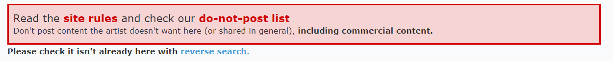
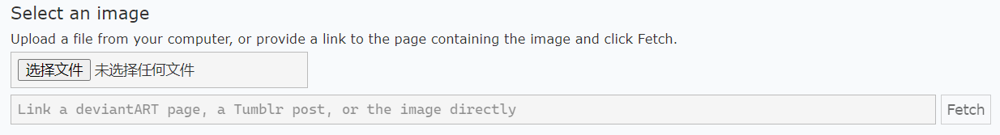
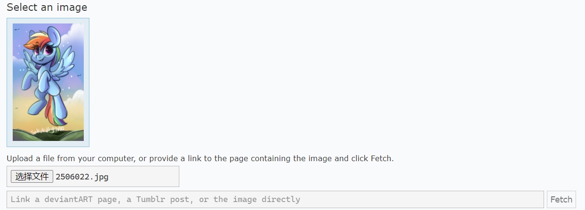
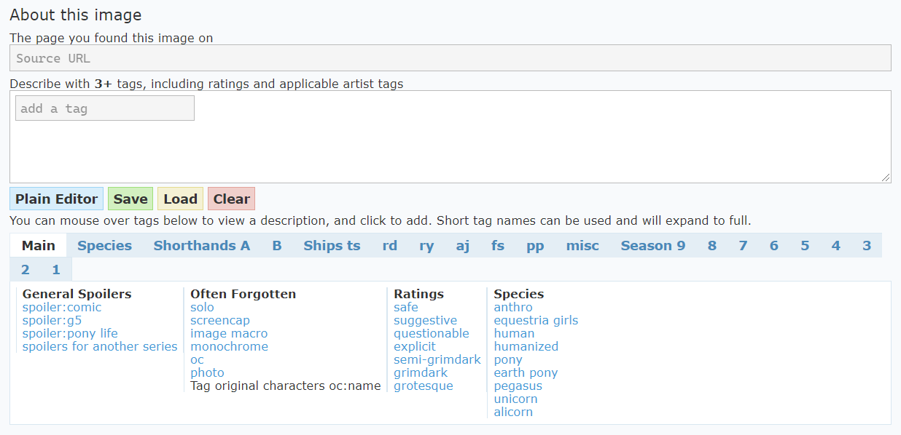
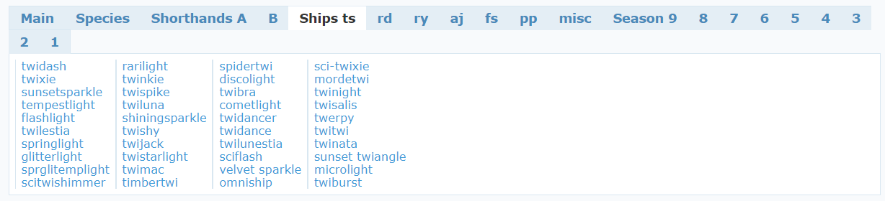
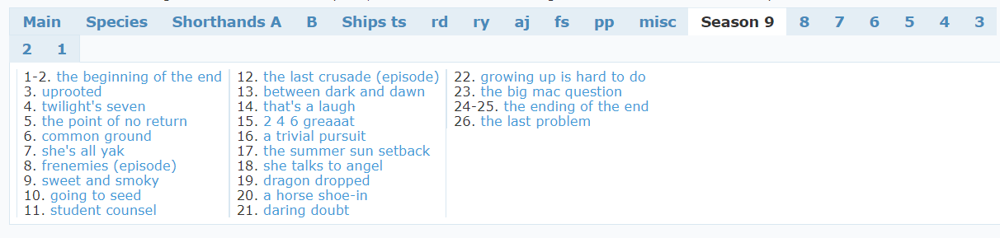
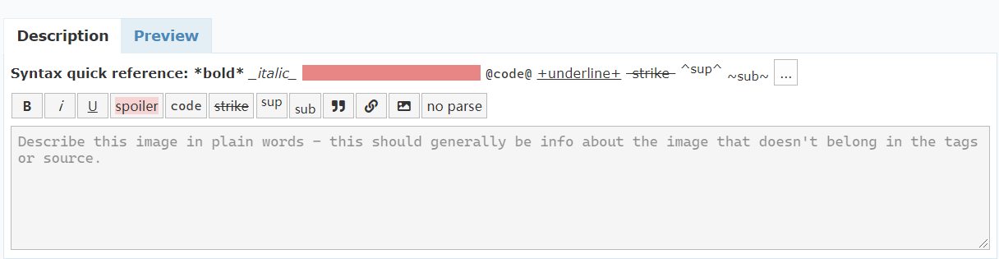
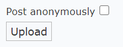
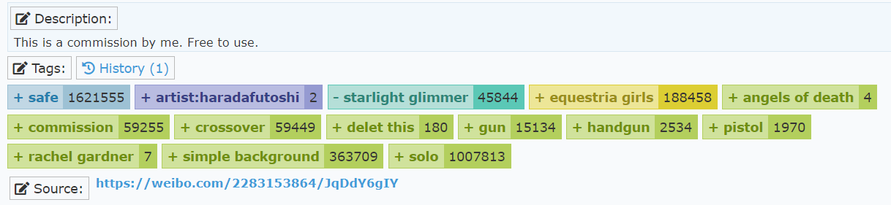

# 5. 上传图片

在 Derpibooru，每个账号都可以上传图片！但是，Derpibooru 不是图床，你需要遵守站点的规定。

## 5.1 上传须知

以下内容摘录自站点守则（Site Rules）。

### 5.1.1 给图片打标签

标签系统是 Derpibooru 的基础。它的重要性就如同论坛帖子的标题，如果一张图没有标签，它就无法被搜索到，也无法与过滤器系统互动。因此，每一张图片都必须有标签。

需要注意，标签是用来描述图片的构成元素的，不能把大段的描述当做标签。如果你不知道一个描述是否适合当一个标签，可以先试着搜索一下，如果这个标签已经存在了，那么就没有问题。例如，`this art work is really awesome` 不适合拿来做标签，但是 `20% cooler` 可以作为一个标签。

如果你要上传图片，请对照下面的这个列表给你的图片打标签。

* 首先，每一张图都需要有**分级标签**。如果你忘了什么是分级标签，请参阅第二章的内容。
* 然后，加上**创作者标签**，也就是 `artist:xxx`。如果创作者未知，那么使用 `artist needed`
  * 如果你就是创作者，那么你得决定好你的标签叫什么，然后到自己的主页绑定标签。虽然可以申请多个标签指向同一个创作者，但是还是尽量保持名称的一致。
  * 如果是转载推特/deviantart/微博的图片，那么最好和作者的用户名（不是昵称）保持一致。但是，如果作者已经有一个 `artist:` 标签，而且和他的用户名不同，那么当然是优先使用现有的标签。
  * 创作者标签是允许有非英文字母的！所以 `artist:张三` 这样的标签没有问题。
* 如果图片是基于某种图片的加工，那么需要加上 edit 类标签。具体来说：
  * 基于别人的图片进行修改所得到的图片（比如描图，改色），都需要加入 `edit`。然而，如果你是自己从头开始，用相似的设定来画，那么就不需要 `edit`。
  * 作者自己做的修改不需要 `edit`，一般使用的是 `alternate version`。
  * 如果你觉得自己的修改非常不错，可以加入一个 `editor:xxx` 表明是你做出的修改。
  * 在作者允许的情况下，如果你很大程度参与了图片的创造（例如给线稿上色），那么有时候你可以把自己作为 artist 和原作者并列。
* 从剧集中截图的图片，需要加入 `screencap`。
  * 如果做出了编辑操作，还需要加入 `edited screencap`。
  * 最好再附加上包含的剧集标题。如果你确实不知道是哪一集的图，可以留空，等待好心人为你添加。
* 在没有图片来源的时候，需要加入 `source needed` 标签。
  * 如果图片是第一手上传到 Derpibooru，就使用 `derpibooru exclusive` 标签。
* 如果图片有闪烁，那么必须加入`seizure warning`（癫痫警告），以免对他人造成伤害。
* 如果图片有脏话或者竖中指这样的粗鲁行为，也需要加入 `vulgar` 标签。
* 图片中出现的**所有角色**，都要加入相应的标签。就算这个角色只露出半边脸/是个小玩偶，也需要加入进去。别忘了小马们的宠物也是一类角色！
* 图片的角色如果是 OC，那么需要加入 `oc` 标签。
  * oc 如果有名字，可以按 `oc:xxx` 的格式加上名字。不要不加前缀就直接标注一个 oc 的名字。
  * 一张图如果只有 oc，还需要补充 `oc only` 标签。
* 小马国女孩相关需要加入 `equestria girls` 标签。

上面说的都是必须加入的标签。还有一些标签你可以看心情加入：

* futa。扶她。
* 生物种类，例如 pony, human, unicorn……
* shipping，提示人们这是在磕 CP。CP 一般还有专属的 CP 名，可以在上传器中找到。
* solo，图片只有单个角色。
* simple background，适用于背景只有纯色这样的图片。
* monochrome，单调色彩的图片。
* photo/ irl (in real life)，适用于现实中的图片。

另外，标签是人人可编辑的，如果你觉得一张图片缺少了某个标签，那么你可以自己补充上去。同样的，别人也会为你补充标签。

### 5.1.2 尊重创作者

创作者们的辛勤付出永远是第一位的，你不能因为不喜欢某个作品就随意进行加工恶搞。正确的做法是屏蔽相关标签。请记住这一点。

* 总则：如果作者不允许，不要上传到 Derpibooru。
* 如果没有作者的明确允许，不要上传经过任何修改过的图片。尤其是把作者水印去掉的图片。
* 作者没有公开的图片也不要上传（例如需要赞助一定费用才能查看的图片）。也不要上传包含盗版网站水印的图片。
* 不要上传一整段的官方版权视频、音频。具体的时间界定请查看站点规则。
* 有些作者不允许上传他们的图片，或者只允许作者自己上传，又或者不允许上传 edit 图片，又又或者禁止某些特定的用户上传图片。先查看他们的 Do Not Post 规则再考虑上传！

### 5.1.3 不要上传无关图片/违禁图片

一个小马图片站点，自然是不允许上传与 My Little Pony 无关的图片的。

并不仅仅只是图片有小马，就是有关图片。你在便利店买了一包印有小马的跳跳糖，然后拍了个照片。这样的照片虽然有小马，但是通常也被视为无关图片。

不过，你穿着小马国女孩装的 cosplay 照片、给自己买的寿屋手办拍摄的照片，都可以算作有关。不过这种图片一般没什么人爱看就是了……

除此之外，虽然 Derpibooru 的容许范围很自由，但还是有一类图片是绝对不能上传的：与未成年人类相关的、含性描写的内容。无论是真人还是绘画，都不能包含这种元素。啊，好像幼驹没有问题，但是你不会真的……

## 5.2 图片上传器

在左上角 Derpibooru 的标志旁边的就是上传按钮。

首先，上传器用大红框框警告你，不要违反 DNP，同时也要用图片搜索确认站点没有相同的图片。

然后，按正常流程上传你的图片。有 deviantart/Tumblr 直接导入的功能，不过推特是不支持直接导入的。

选择好之后会显示一个预览。

然后添加图片来源，并打标签。

如你所见，标签编辑器下面一句提供了很多直接用鼠标就可以点选的标签。如果这里没有你想要的标签，就自己输入，然后按回车确认。

例如，Ships ts 就包含了 Twilight Sparkle 的所有 CP 的标签。

Season 部分贴心地提供了剧集分集标签。

最后补充一些说明。如果是转载的图片，最好附加原作者的信息。

上传之前你还可以选择是否匿名上传。

对于你自己上传的图片，你还可以修改描述。别人上传的就不能修改了。

