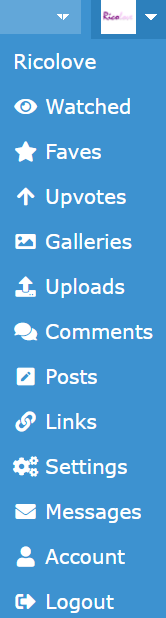
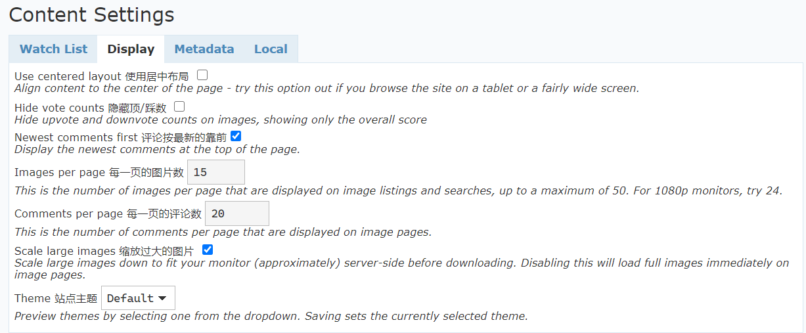

# 6. 账户页面与设置

如果你想在 Derpibooru 上参与社交活动，那么好好打扮你的账户是很有必要的。谁看了评论区里大佬后面一排的勋章不心动的呢？

不过本手册专注于图片查看，所以在这里只简单介绍一下。

## 6.1 关于账户

点击网站右上角的头像，你就可以进入你的个人主页。

在这里，大家可以看到你的头像、自我介绍、徽章、活跃统计、上传/顶/收藏/评论等信息。

如果你想更换头像，那么点击主页的头像就能进入更换页面。

把鼠标悬停在头像上，可以看到一个下拉菜单。其中，Watched/Faves/Upvotes/Uploads 都会跳转到一个特殊搜索，也就是你的关注图片/收藏图片/顶过的图/上传的图。Comments 里面是你的过往评论。Settings 是账户和站点各方面的设置，而 Account 涉及账户的密码修改等操作。

## 6.2 关于设置

点击 Settings，会有四个选项卡出现。无论是哪一项，修改过后一定要点击 Save My Setting 才能生效。这里只介绍前面两个选项卡，后面两个基本上不需要任何改动。

### 6.2.1 Watch List

第一个选项卡就是管理你的 Watchlist。

在这里你可以删除你关注的标签，还可以加入一些基于搜索的关注、过滤规则。

### 6.2.2 Display

这里的选项是一目了然的。

下面展示一下三个站点主题的样式：

**Default**

**Dark**

**Red**

