# 0. 欢迎来到 Derpibooru

Derpibooru 是一个基于 philomena 系统的马图分享站点。在这里，来自全世界的小马画师都可以分享他们的作品。

由于 Derpibooru 名字来源于小呆 Derpy Hooves，所以又把 Derpibooru 叫做呆站。

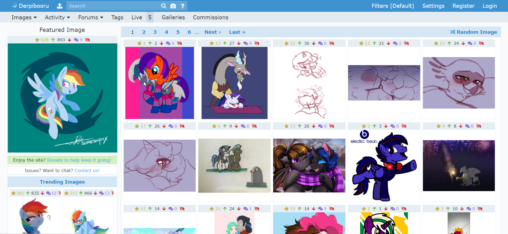

Derpibooru 的网址是 derpibooru.org，请注意 www.derpibooru.org 虽然指向同一站点，但是登录状态不互通。

网站不需要登录也能查看所有的图片。例如上图，Featured Image 是网站编辑推荐图，Trending Images 是近期热图，剩下右边一大块是最新图片。


点击右上角的 Register，即可注册一个账号。在本文撰写的时候，Derpibooru 已经采用了更智能的注册验证码。以前都是选 Mane6 的可爱标记来着……


注册之后，你就可以更换头像、构建自己的 Watchlist、管理自己的过滤器、收藏自己喜欢的图片了。

# 1. 图片的相关操作

在 Derpibooru 里，每张图片都有一个唯一的数字 id，这个 id 是根据上传顺序增序的。

如果已知一张图的 id，可以输入 derpibooru.org/id 来访问这张图。例如，1 号图片的地址就是 derpibooru/1。

图片页面由以下部分组成：

* 顶部操作栏


* 图片本体


* 广告区（图中的 furbooru 也是一个基于 philomena 的图站。）


* 详细信息，包括图片描述、标签、图片源地址。


* 评论区


# 1.1 顶部操作栏

这里介绍一下比较常用的功能。

首先是**分数系统**。


图片的分数系统包含四个元素：收藏数，顶数，分数，踩数，评论数。


其中只有顶踩会影响分数。收藏的图片会放在 https://derpibooru.org/search?q=my:faves 中，而且收藏操作也会自动顶图。

图片的分数主要用于图片排序和过滤条件，比如近期热图 Trending Image 就是采用 Wilson score 进行排序。


然后是**查看与下载**。


View 是查看，Download 是下载，View/Download 和 VS/DS 的功能是一样的，区别在于文件名是否包含标签信息。

例如，Download 下载的文件名是

```
1__dead+source_safe_artist-colon-speccysy_fluttershy_pegasus_pony_artifact_cloud_cloudy_cute_derpibooru+legacy_eyes+closed_female_first+fluttershy+picture.png
```

而 DS 下载的文件名是简单的 `1.png`。


最后是**图片的信息**。


它告诉我们图片于何时上传，上传者是谁，图片的尺寸，格式以及大小。


# 1.2 图片查看

对于一般的图片，在进入图片页面后就会显示图片本身。

但是，对于处于 Spoiler/Hide 状态的图片，需要你点击一下，才会显示出来。

最常见的 spoiler 就是 suggestive，因为图片可能包含不适合公开阅览的内容（例如轻微色图）。其它例如 vulgar（粗话），seizure warning（闪烁瞎眼）也比较常见。

在 MLP:FiM 大结局之前，还有一种常见的 spoiler 就是 spoiler（剧透），现在已经几乎没有了。


如果一张图片很大，那么加载起来可能会比较困难。因此页面第一次呈现的图片一般都是缩略图片。当你再次点击这张图的时候，才会加载原图。


点击前。


点击后。


对于特别大的图片，点击第二次还能再次放大。点击第三次，就会回到缩略图状态。

# 1.3 评论

评论的特殊格式在评论区上方已经有提示了，根据自己的需要使用即可。


特别的，如果你要在评论插入一张本站的图片，可以使用 `>>1t` 的格式，这样就会插入图片本身，而且可以点击直达图片的网页。而如果是 `>>1` 插入的就是一个链接。在输入完成后，可以点击 Preview 查看最终效果。


最后，Derpibooru 是允许匿名评论的，所以你可以点击 Anonymous 选项来隐藏自己的身份。


# 2. 标签系统

就像在视频网站发布视频的时候需要你填写相关话题，每一张图片在上传到 Derpibooru 的时候都需要打上相关标签，而且越详尽越好。

标签的重要性体现在图片筛选和搜索上。

每个人都有自己喜欢的和不喜欢的图片类型，当你遇到喜欢的标签，你可以对其进行 Watch，这样相关的图片都会推送到你的 Watchlist。而如果你不喜欢某类标签，则可以选择 Spolier 或者 Hide 操作。

除此之外，Derpibooru 的搜索系统也是基于标签的。图片没有标题，网站也不提供模糊搜索，你必须精确地提供一个标签才能搜到图片。

不同的标签可能含有同一个含义，这一般是方便搜索，例如 `Twilight Sparkle` 和 `ts` 都指向暮光闪闪。

**标签不区分大小写**，下面为了美观可能会加入一些大写字母。


# 2.1 基础标签简介

在网站 Tag Guidelines 有标签使用的相关说明，这里简单总结一下。

### 2.1.1 分级标签

Derpibooru 允许上传少儿不宜的内容（各种方面的），因此为了方便浏览，每一张图都需要有一个分级标签。普通的图片可以自由出现，而涉及性描写或者令人恶心的内容就需要根据用户设置来决定是否出现。

每一张图都需要打上**性描写标签**。

* `safe`，上班能看的图片，小孩能看的图片，正剧出现的图片。非常安全。
* `suggestive`，包含性暗示的图片。这里的程度可高可低，详细标准就不列出来了。
* `questionable`，有胸部点露出、女性骆驼趾的图片，或者基本上离 R18 就差一步的图。
* `explicit`，R18 的图片。

除此之外还有**暗黑分级**和**恶心分级**。请注意，**有这些分级的就不能打 safe**。

* `semi-grimdark`，一般般的暗黑，比如萍卡美娜拿着一把刀，角落里的云宝眼睛已经变成了 X。
* `grimdark`，会让人做噩梦的暗黑，比如萍卡美娜拿着带血的刀，自己和云宝身上溅满了血。
* `grotesque`，令人反胃，比如含有断肢或者奥利给的图片。


### 2.1.2 角色标签

角色标签都是按角色全名。大多数角色都有标签缩写。部分角色拥有别名，别名是和原名并行的，指向不同的内容。

* `Twilight Sparkle`，缩写 `ts`
* `Rarity`，缩写 `ry`
* `Sunset Shimmer`，缩写 `sus`
* `DJ pon-3`，缩写 `dj`，别名 `Vinyl Scratch`


如果你想知道一个角色的缩写，就在搜索框里输入全名。例如，我想知道糖糖的缩写是什么，就在搜索框里填写 `bon bon`。然后搜索结果中就会有以下提示信息：


**Aliases** 告诉我们这个标签有什么等价写法，于是我们就知道搜索 `bon` 也能找到 `bon bon` 这个标签。

**Implies** 告诉我们相关的标签，例如 `cake` implies `food`，而与 Bon Bon 相关的就是她的“真实名称”。然而，`bon bon` 和 `sweetie drops` 并不等价，虽然一般的图片都会同时带上这两个标签。


特别地，对于自创角色（OC），都统一带上 `oc` 标签，且如果 oc 有名字的话，也在名字前加 oc 前缀，例如 `oc:sugar morning`。


### 2.1.3 剧集标签

对于正剧，有两种标签方式。例如，对于 S05E03：

* `spoiler:s05e03`，不管是正剧，EQG 还是 Pony Life，使用编号的时候都在前面加 spoiler 前缀。

* `castle sweet castle`，即本集的名称。

对于 Equestria Girls 短剧和 Pony Life，基本上都可以靠名称来搜索到。


### 2.1.4 其它常见的标签

* artist:???，例如 artist:tohupo，艺术家标签，每一张图都需要标注作者。
* edit，图片是在某张图的基础上编辑得来的。
* spoiler，可能会造成剧透。
* vulgar，包含脏话。
* seizure warning，包含闪烁，以免浏览者犯光敏性癫痫。
* solo，图片只有一个角色。
* 3d，立体的图像。
* simple background，单调的背景。


# 2.2 标签的相关操作

将鼠标悬停在标签上，就能看到相关的操作。


### 2.2.1 关注（Watch）与关注列表（Watchlist）

对你喜欢的标签，你随时可以点击 Watch 进行关注，或者在关注后点击 Unwatch 取关。

关注标签后，在首页上会出现一个 Watched Images 栏目。这个栏目呈现的内容实际上是特殊搜索 `my:watched`，凡是带有已关注标签的图片都会在这里出现。

关注机制不与遮盖和隐藏机制冲突，实际上它相当于把你关注的标签通过与逻辑进行了一个搜索。

当你关注了某个标签，标签前的 + 号会变成 - 号。


### 2.2.2 遮盖（Spoiler）与隐藏（Hide）

Spoiler 和 Hide 操作涉及过滤器，这些内容将在后续的章节细说。

在这里简单介绍一下，如果你 Spoiler 了一个标签，那么相关的图片就会在展示之前遮盖住，只有点击进去了，才能观看到这个图片。

而如果你 Hide 了一个标签，那么相关的图片将完全不会出现，搜索的话也只能得到空白结果。只有输入图片的链接，才能访问到这个图片。

遮盖和隐藏只在使用自定义滤器时出现。如果你使用全局滤器，那么这些操作会消失，取而代之的是一个前往滤器设置页面的选项。


# 3. 过滤器系统

过滤器提供了遮盖（Spoiler）和隐藏（Hide）的功能。这两种功能是基于标签的，如果某张图的标签被设置了 Spoiler 或者 Hide，那么就会有相应的可见性限制。

在网站右上角，头像旁边，可以看到过滤器的相关设置。


* Filters 选项可以前往过滤器设置页面。

* 写着 Default 的下拉菜单可以改变当前使用的滤器。
* 写着 Static 的下拉菜单可以改变 Spoiler 图片的展示方式。


## 3.1 遮盖和隐藏

通过遮盖和隐藏的配置，你可以借助滤器来让网站**不显示**一些图片。当你在公共场合看马图的时候，把 R18 的图片隐藏起来是很有必要的功能。

正如前面说到，这两种状态都是基于标签的。


----

**对于被遮盖的图片**，虽然会从图片列表中显示出来，但是在呈现原图之前，会先显示一个遮盖图。


上面左边是 safe 的图，因此会直接显示。而右边是 suggestive 的图，因此会显示一个有 Trixie 的遮盖图。


点击到图片页面，依然会显示遮盖图。只有在你点击了遮盖图之后，原图才会显示出来。


在 `official spoiler image` 这个标签下可以看到网站当前使用的遮盖图。


当你设置某个标签为 Spoiler 状态后，如果这个标签有专属的遮盖图，那么就显示这张图。否则，默认使用 tag hidden 这张图。


特例是，如果你直接搜索某个 Spoiler 状态下的标签，那么遮盖就会被取消。


----

**对于被隐藏的图片**，这张图会从图片列表中消失，如果你搜索 Hide 状态的标签，那么一张图都不会呈现出来。


但是，如果你借助链接直接打开了某张被隐藏的图片，那么图片还是可以看到的，这时候会像遮盖的图那样用一张遮盖图挡住。


## 3.2 如何构建你的滤器

Derpibooru 提供了一些基础滤器，其中最常用的就是 Default 和 Everything。


* Default，就是默认的滤器，提供最安全的图片内容。
* Everything，什么都不遮挡，全部图片都会呈现。

但是，并不是说 Everything 就会让你拥抱美好的色图世界。因为之前也说过，少儿不宜的东西不只是色情内容。什么吃粑粑啊，被粑粑吃啊（？），各类精神污染也会一并呈现出来。所以最好的选择是构筑一个自己的滤器。


推荐的方法是点击 Default 的 Copy and Customize。然后就会进入新建滤器页面。


红色方块的是滤器名称，比如你可以像我一样取一个 `Ricolove's Default`，或者简单的 `My default` 之类的。蓝色方框的是滤器描述，可以根据自己的需要随便改改。

点击 Save Filter 按钮，滤器就创建成功了。这时你可以点击红框中的 Use this filter 启用你的新过滤器，但是最常用的方法是使用下拉菜单，点击切换。


刚刚的页面是一些比较技术性的滤器设置，如果你懒得研究的话，就不要动了，然后通过可交互的标签来操作 Spoiler 和 Hide。例如，我不怕脏话，我想取消 `vulgar` 的遮盖。那么，你可以把鼠标放在这个标签上，这时候就会有 Watch, Spoiler 和 Hide 的选项。


点击 Unspoiler，从此 `vulgar` 就不会被遮盖了。

Hide 也是同理的，这里就不赘述了。


## 3.3 遮盖的展示方式


在滤器旁边可以调整遮盖在缩略图状态时的展示方式。

* static：点击图片，进入图片页面后，再点击遮盖图，才能看到原图。
* click：点击缩略图，会展示原图，再次点击才进入图片页面。
* hover：鼠标悬停在缩略图上，就会显示原图。
* off：关闭遮盖图功能。


这是被遮盖的状态。


这是展示出来的状态。


# 4. 搜索系统

网站顶部栏左侧就是搜索框。同时，每一个搜索结果的下方也会提供一个搜索框，并且这个搜索框有更多的点选项。

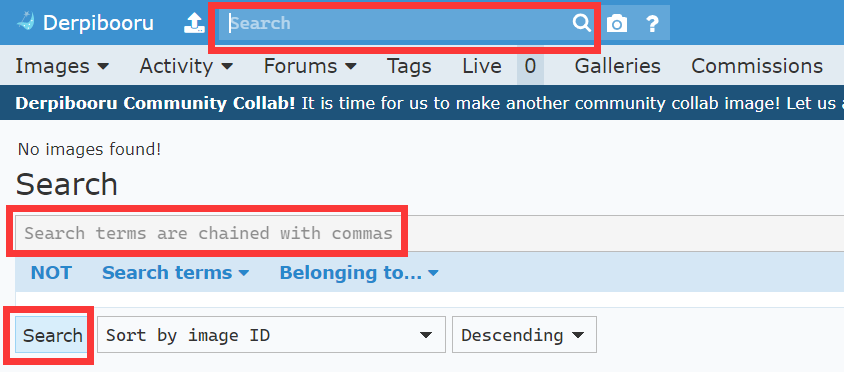


## 4.1 搜索的语法

不同于一般的论坛/搜索引擎，作为一个图站，Derpibooru 的搜索系统是**基于标签的搜索**。

它既不支持描述文字的搜索，也不支持标题搜素（虽然本来就不存在标题）。

也就是说，如果你搜索 `yellow pony with pink hair`，这对一般的搜索引擎来说可以理解，但是在 Derpibooru 不会有任何返回结果。

下面我们由浅入深地探讨如何使用 Derpibooru 的搜索功能。请注意，本文不会把所有的搜索参数介绍全，有兴趣的话你应该查阅站点自己的说明书，也就是搜索框旁边的问号标。

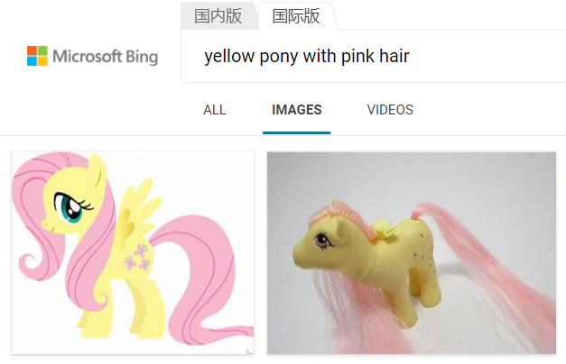


### 4.1.1 单个标签

单个标签是最基础的搜索。在搜索单个便签的时候，还会显示出该标签的详细信息，比如简短的介绍，别名，关联标签。

在标签部分，我们已经提到了什么是标签的**等价写法**和**相关标签**，以及标签**不区分大小写**的性质。这些性质就是通过搜索系统表现出来的。


需要注意的是，如果你对某些标签设置了遮盖（Spoiler），那么如果你的搜索包含这个标签，就会使相关的遮盖失效。例如，你不喜欢张三的作品，并进行了遮盖。但如果你直接搜索`artist:张三`，那么搜索结果中就不会遮盖张三的图片。


### 4.1.2 多个标签

多个标签用**逗号**分隔。逗号的作用相当于「与」条件。

逗号和标签之间可以存在空格，空格会被省略。也就是说，`a,b,c` 和 `a, b, c`是等价的，并不会导致搜索到含前缀空格的标签。

比如，对于`ts, fs, aj`这样的搜索语句，会得到同时包含 Twilight Sparkle、Fluttershy、Applejack 三个角色的图片。如果其中少了任何一个角色，都不会进入搜索结果。

但是，搜索结果中并不限定只拥有这三个角色。你可能会得到很多包含六位主角的图片。如果你要限定没有 Rarity、Pinkie Pie 和 Rainbow Dash，那么你就需要用下一部分提到的逻辑符号。


### 4.1.3 逻辑符号

逻辑符号有以下三种：

* 与，符号为逗号，`&&` 和 `AND` 
* 或，符号为`||` 和 `OR`
* 非，符号为`-`，`!` 和 `NOT`

以上符号均为半角、大写字母。

在图片中，所有没有包含在搜索语句的标签，都不会产生任何影响。


逻辑符号应该大家都很熟悉，不熟悉的话看看以下例子就了解了。

* `ry, aj` ：同时包含 Rarity 和 Applejack 两个标签的图片，

  

* `ry || aj`，只要有 Rarity 或 Applejack 其中一个就好。两个都有也行。

  

* `ry, aj, !ts, !pp, !fs, !rd`，同时包含 Rarity 和 Applejack， 且不含其它四位主角。

  


需要注意的是，与是优先于或的。例如，`ry, aj || pp` 意味着要么同时有 Rarity 和 Applejack，要么可以只有 Pinkie Pie 一个。如果你是想看 rarijack 或者 raripie 这样的 CP 组合，就应该使用括号：`ry, (aj || pp)`。

### 4.1.4 限定条件

在搜索页面下方的搜索栏里，有一个 Search terms 点选菜单：


这些是搜索的限定条件。

例如，Trending Image 就是限定了`first_seen_at.gt:3 days ago`，即三天之内的图片。


搜索系统提供的条件有很多，我们以 Number of upvotes 为例，也就是顶的票数。点击之后，你的搜索框会多出一个条件，`upvotes.gte:100`。这是一个示例，其中，`.gte`指定大于（**g**reater **t**han）等于（**e**qual），因此这个条件指定的就是顶数大于等于 100 的图片。

而如果你品味独特，想专门看恶评如潮的图片，就可以使用 `score.lt:-10`，就能查看分数小于（**l**ess **t**han）-10 分的图片。什么人才会想看这样的图啊（


除了数量，还可以对时间范围进行限制。例如，我想看 2019 年的图片，那么搜索条件就是`created_at.gt:2018,created_at.lt:2020` 或者 `created_at.eq:2019`。条件后面的年份，实际上可以是一个更具体的时间值，例如 `created_at.gt:2020-06` 可以查看 2020 年 7 月 1 日之后发布的图片。


## 4.2 排序条件

排序是独立于搜索语句的条件，因为它不参与限制哪些图片该出现，而只是决定图片出现的顺序而已。

注意，Descending 是降序，Ascending 是升序

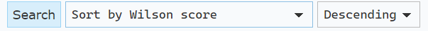

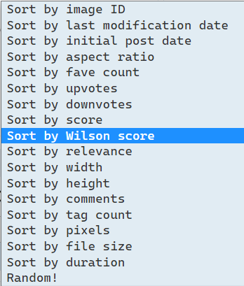

最主要的排序模式是以下几种：

* image ID，即按图片 ID，也就是发布的顺序。
* upvotes/downvotes/score，显然就是分数相关。
* Wilson score，这是一个综合了投票情况的特殊分数。例如，一个200顶100踩的图片，和一个99顶0踩的图片，前者的分数是 100，后者的分数是 99，虽然前者分数高，但是 100 踩说明它也有不讨喜之处，而当后者的顶达到 200 的时候，分数很大可能比前者高，因此综合来看，99顶0踩的图理应放在前面。而 Wilson score 正是解决这一问题的特殊分数。


热门图片的排序方式就是按 Wilson score。在使用纯分数的时代，排在前列的通常都是浓艳的 R18 图，人之本性如此。使用了 Wilson score 之后，这一情况就大为改观了，可爱图重新占了上风。好耶！

## 4.3 搜索实战

现在实战一下。我现在手上有这张照片：


那么怎么在 Derpibooru 上找到这张图的电子版本呢？

首先，我们能看到这张图存在四个角色：Rarity，Applejack，Spike，Opalescence。我们只要在包含这四个角色的图片里筛选就可以了。

然后，使用简写，我们可以确定搜索语句是：`ry, aj, sp, opal`


但是正如我们所料，搜索结果中出现了很多不相关的图片，这些图片中同时出现了许多角色，因此很容易被只有角色的搜索语句捕捉到。


解决的办法有三种：

**第一，使用分数排序。**因为这张图做工精美，必然会有很多人加分。

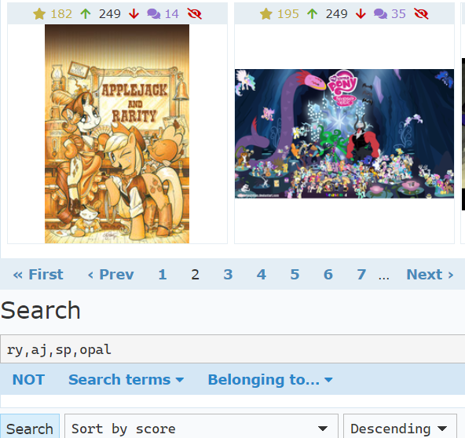

运气还算好，我们在第二页就发现了这张图。


**第二，添加更多描述标签**。我们观察到 Rarity 的身后有一个木桶，于是我们再加入一个 barrel 标签：

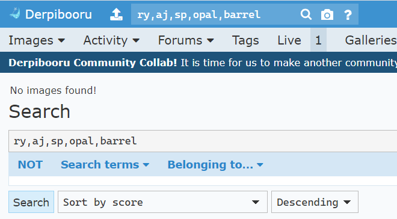

没有任何搜索结果。这也是在预料之中的，因为图片的标签是由 Derpibooru 的所有人来维护的，而不是由某个 AI 自动提取的。很可能是这张图没有被加入 barrel 这个标签，所以无法搜到。


**第三，限定不出现角色**。我们直接禁止其余四个小马主角出现在我们的搜索结果里。

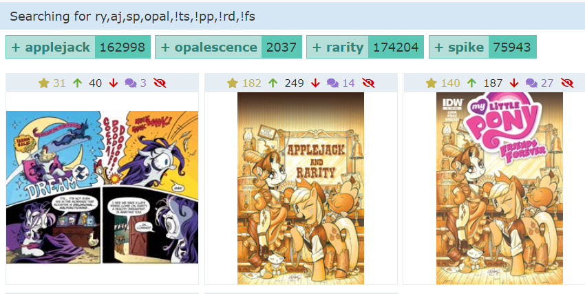

这次的结果非常好，第二个图就是我们想要的结果。


## 4.4 图片搜索

Derpibooru 是支持图片搜索的，但是效果很有限，一般只在你拿到的图片是整体接近于原图的时候才管用。如果图片有裁剪、水印，或者内嵌了一些文字信息，那么图片搜索一般不会有结果。

图片搜索的入口在搜索框旁边的相机图标处。

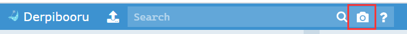

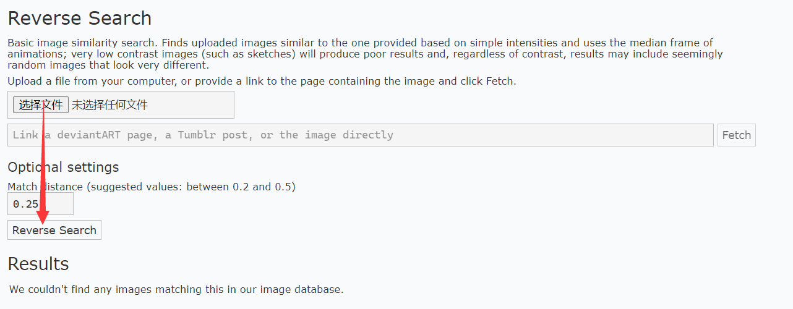

选择文件上传，并点击 Reverse Search 按钮，即可进行图片搜索。


# 5. 上传图片

在 Derpibooru，每个账号都可以上传图片！但是，Derpibooru 不是图床，你需要遵守站点的规定。


## 5.1 上传须知

以下内容摘录自站点守则（Site Rules）。

### 5.1.1 给图片打标签

标签系统是 Derpibooru 的基础。它的重要性就如同论坛帖子的标题，如果一张图没有标签，它就无法被搜索到，也无法与过滤器系统互动。因此，每一张图片都必须有标签。

需要注意，标签是用来描述图片的构成元素的，不能把大段的描述当做标签。如果你不知道一个描述是否适合当一个标签，可以先试着搜索一下，如果这个标签已经存在了，那么就没有问题。例如，`this art work is really awesome` 不适合拿来做标签，但是 `20% cooler` 可以作为一个标签。

如果你要上传图片，请对照下面的这个列表给你的图片打标签。

* 首先，每一张图都需要有**分级标签**。如果你忘了什么是分级标签，请参阅第二章的内容。
* 然后，加上**创作者标签**，也就是 `artist:xxx`。如果创作者未知，那么使用 `artist needed`
  * 如果你就是创作者，那么你得决定好你的标签叫什么，然后到自己的主页绑定标签。虽然可以申请多个标签指向同一个创作者，但是还是尽量保持名称的一致。
  * 如果是转载推特/deviantart/微博的图片，那么最好和作者的用户名（不是昵称）保持一致。但是，如果作者已经有一个 `artist:` 标签，而且和他的用户名不同，那么当然是优先使用现有的标签。
  * 创作者标签是允许有非英文字母的！所以 `artist:张三` 这样的标签没有问题。
* 如果图片是基于某种图片的加工，那么需要加上 edit 类标签。具体来说：
  * 基于别人的图片进行修改所得到的图片（比如描图，改色），都需要加入 `edit`。然而，如果你是自己从头开始，用相似的设定来画，那么就不需要 `edit`。
  * 作者自己做的修改不需要 `edit`，一般使用的是 `alternate version`。
  * 如果你觉得自己的修改非常不错，可以加入一个 `editor:xxx` 表明是你做出的修改。
  * 在作者允许的情况下，如果你很大程度参与了图片的创造（例如给线稿上色），那么有时候你可以把自己作为 artist 和原作者并列。
* 从剧集中截图的图片，需要加入 `screencap`。
  * 如果做出了编辑操作，还需要加入 `edited screencap`。
  * 最好再附加上包含的剧集标题。如果你确实不知道是哪一集的图，可以留空，等待好心人为你添加。
* 在没有图片来源的时候，需要加入 `source needed` 标签。
  * 如果图片是第一手上传到 Derpibooru，就使用 `derpibooru exclusive` 标签。
* 如果图片有闪烁，那么必须加入`seizure warning`（癫痫警告），以免对他人造成伤害。
* 如果图片有脏话或者竖中指这样的粗鲁行为，也需要加入 `vulgar` 标签。
* 图片中出现的**所有角色**，都要加入相应的标签。就算这个角色只露出半边脸/是个小玩偶，也需要加入进去。别忘了小马们的宠物也是一类角色！
* 图片的角色如果是 OC，那么需要加入 `oc` 标签。
  * oc 如果有名字，可以按 `oc:xxx` 的格式加上名字。不要不加前缀就直接标注一个 oc 的名字。
  * 一张图如果只有 oc，还需要补充 `oc only` 标签。
* 小马国女孩相关需要加入 `equestria girls` 标签。


上面说的都是必须加入的标签。还有一些标签你可以看心情加入：

* futa。扶她。
* 生物种类，例如 pony, human, unicorn……
* shipping，提示人们这是在磕 CP。CP 一般还有专属的 CP 名，可以在上传器中找到。
* solo，图片只有单个角色。
* simple background，适用于背景只有纯色这样的图片。
* monochrome，单调色彩的图片。
* photo/ irl (in real life)，适用于现实中的图片。


另外，标签是人人可编辑的，如果你觉得一张图片缺少了某个标签，那么你可以自己补充上去。同样的，别人也会为你补充标签。

### 5.1.2 尊重创作者

创作者们的辛勤付出永远是第一位的，你不能因为不喜欢某个作品就随意进行加工恶搞。正确的做法是屏蔽相关标签。请记住这一点。

* 总则：如果作者不允许，不要上传到 Derpibooru。
* 如果没有作者的明确允许，不要上传经过任何修改过的图片。尤其是把作者水印去掉的图片。
* 作者没有公开的图片也不要上传（例如需要赞助一定费用才能查看的图片）。也不要上传包含盗版网站水印的图片。
* 不要上传一整段的官方版权视频、音频。具体的时间界定请查看站点规则。
* 有些作者不允许上传他们的图片，或者只允许作者自己上传，又或者不允许上传 edit 图片，又又或者禁止某些特定的用户上传图片。先查看他们的 Do Not Post 规则再考虑上传！

### 5.1.3 不要上传无关图片/违禁图片

一个小马图片站点，自然是不允许上传与 My Little Pony 无关的图片的。

并不仅仅只是图片有小马，就是有关图片。你在便利店买了一包印有小马的跳跳糖，然后拍了个照片。这样的照片虽然有小马，但是通常也被视为无关图片。

不过，你穿着小马国女孩装的 cosplay 照片、给自己买的寿屋手办拍摄的照片，都可以算作有关。不过这种图片一般没什么人爱看就是了……


除此之外，虽然 Derpibooru 的容许范围很自由，但还是有一类图片是绝对不能上传的：与未成年人类相关的、含性描写的内容。无论是真人还是绘画，都不能包含这种元素。啊，好像幼驹没有问题，但是你不会真的……


## 5.2 图片上传器

在左上角 Derpibooru 的标志旁边的就是上传按钮。


首先，上传器用大红框框警告你，不要违反 DNP，同时也要用图片搜索确认站点没有相同的图片。


然后，按正常流程上传你的图片。有 deviantart/Tumblr 直接导入的功能，不过推特是不支持直接导入的。


选择好之后会显示一个预览。


然后添加图片来源，并打标签。

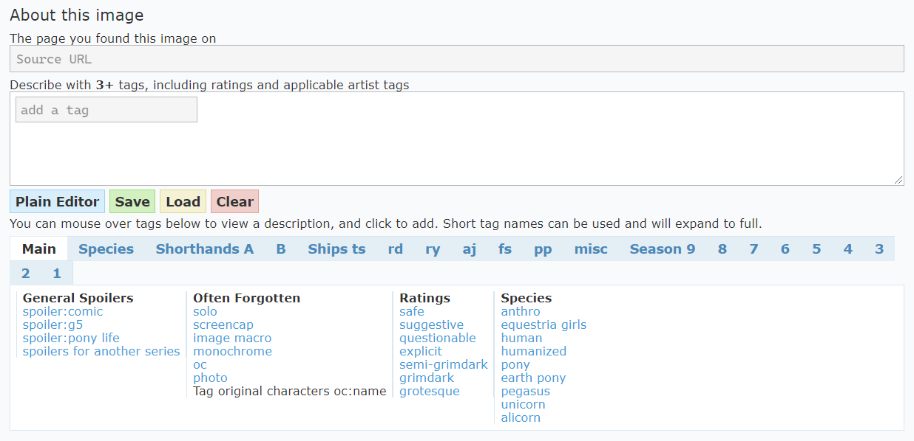

如你所见，标签编辑器下面一句提供了很多直接用鼠标就可以点选的标签。如果这里没有你想要的标签，就自己输入，然后按回车确认。

例如，Ships ts 就包含了 Twilight Sparkle 的所有 CP 的标签。


Season 部分贴心地提供了剧集分集标签。

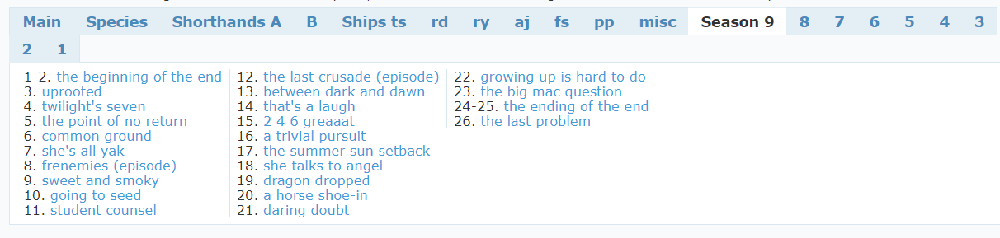

最后补充一些说明。如果是转载的图片，最好附加原作者的信息。

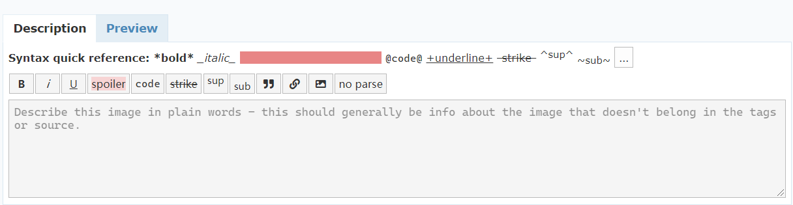

上传之前你还可以选择是否匿名上传。


对于你自己上传的图片，你还可以修改描述。别人上传的就不能修改了。


# 6. 账户页面与设置

如果你想在 Derpibooru 上参与社交活动，那么好好打扮你的账户是很有必要的。谁看了评论区里大佬后面一排的勋章不心动的呢？

不过本手册专注于图片查看，所以在这里只简单介绍一下。

## 6.1 关于账户


点击网站右上角的头像，你就可以进入你的个人主页。

在这里，大家可以看到你的头像、自我介绍、徽章、活跃统计、上传/顶/收藏/评论等信息。

如果你想更换头像，那么点击主页的头像就能进入更换页面。


把鼠标悬停在头像上，可以看到一个下拉菜单。其中，Watched/Faves/Upvotes/Uploads 都会跳转到一个特殊搜索，也就是你的关注图片/收藏图片/顶过的图/上传的图。Comments 里面是你的过往评论。Settings 是账户和站点各方面的设置，而 Account 涉及账户的密码修改等操作。


## 6.2 关于设置

点击 Settings，会有四个选项卡出现。无论是哪一项，修改过后一定要点击 Save My Setting 才能生效。这里只介绍前面两个选项卡，后面两个基本上不需要任何改动。

### 6.2.1 Watch List

第一个选项卡就是管理你的 Watchlist。


在这里你可以删除你关注的标签，还可以加入一些基于搜索的关注、过滤规则。


### 6.2.2 Display


这里的选项是一目了然的。

下面展示一下三个站点主题的样式：

**Default**


**Dark**


**Red**


# 7. 留给你自己探索的东西

看完了本手册，你应该知道如何熟练地与 Derpibooru 的图片打交道了。但是，Derpibooru 还有其它的功能等着你探索。

* Live/Streams，在顶部菜单栏或者首页左下角，有画师的直播。
* Formus，在顶部菜单栏，有各种板块的交流论坛。
* Galleries，在顶部菜单栏和图片详情页面，相当于个人定制化的收藏夹。
* Notification 和 Conversations，在顶部栏，也就是通知和私信。当你评论某个图片的时候，一般也会收到该图片其他人的评论提醒。
* Commissions，在顶部菜单栏，Derpibooru 提供的约稿平台，画师们提供过往作品和出价，让你方便地找到心仪的约稿对象。
* 基于搜索语句的关注与过滤。这个机制在 Filter 和 Settings 里面均有涉及。


# 附录a. Derpibooru 大合照

Derpibooru 有一项传统活动，就是每年一次的 OC 大合照。


这个活动一般在年末开始征稿，在新年之际截稿，然后站点管理组把所有投稿的 OC 审核，并集中到一张大图上。

当合照活动开始时，"**Derpibooru Community Collab**" 的相关公告就会在网页上置顶。


OC 的投稿有一定的标准，毕竟人类自己拍合照也是有姿势标准的。

你可能会想，哎呀，我不会画画，也不懂英语，我只有一个 OC，那我该怎么参与到这个合照里面呢？

小马中国（www.equestriacn.com）这个时候大都会提供一些信息，一些专业的小马画师通常也会义务帮助一些不会画画的大家画 OC。办法总是有的嘛！