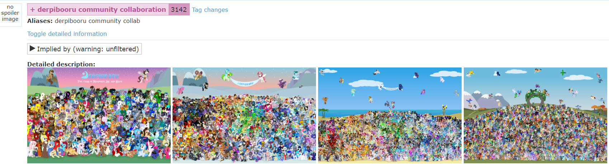

# 附录a. Derpibooru 大合照

Derpibooru 有一项传统活动，就是每年一次的 OC 大合照。

这个活动一般在年末开始征稿，在新年之际截稿，然后站点管理组把所有投稿的 OC 审核，并集中到一张大图上。

当合照活动开始时，"**Derpibooru Community Collab**" 的相关公告就会在网页上置顶。

OC 的投稿有一定的标准，毕竟人类自己拍合照也是有姿势标准的。

你可能会想，哎呀，我不会画画，也不懂英语，我只有一个 OC，那我该怎么参与到这个合照里面呢？

小马中国（www.equestriacn.com）这个时候大都会提供一些信息，一些专业的小马画师通常也会义务帮助一些不会画画的大家画 OC。办法总是有的嘛！